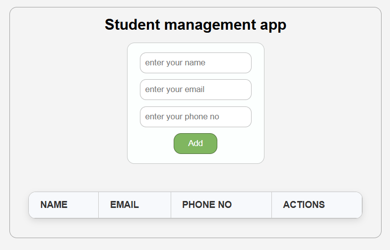
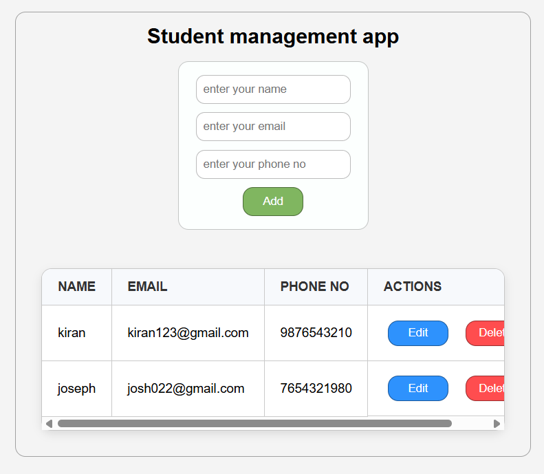

# 🎓 Student Management App

A simple and efficient full-stack CRUD web application built with React, Node.js, Express, and PostgreSQL.
It allows users to add, view, edit, and delete student records in real time through a clean and responsive interface.

# ✨ Features

- 🧍Add new students with name, email, and phone number

- 📋View all students in a structured table

- ✏️Edit and update existing records instantly

- ❌Delete students with a single click

- 🔄Real-time data refresh after every operation

- ⚙️REST API built with Express and PostgreSQL for efficient data handling

- 🎨Clean, responsive React UI

# 🧩 Tech Stack

| Purpose        | Technology                |
|----------------|---------------------------|
| **Frontend**   | React.js, Axios, CSS       |
| **Backend**    | Node.js, Express.js        |
| **Database**   | PostgreSQL                 |
| **Middleware** | CORS                       |
| **Package Manager** | npm                   |

# 📸 Project Preview

## App preview

  

## Data added preview

  

## Edit preview 

  

# 🧠 Learning Outcomes

- Building and connecting a React frontend with a Node + Express backend

- Creating and using RESTful APIs with PostgreSQL

- Managing frontend state using useState and useEffect

- Handling API calls using Axios

- Implementing full CRUD functionality end-to-end

- Understanding the flow of data between client and server

# 🔮 Future Enhancements

- 🔐Add user authentication (JWT)

- 📊Integrate student analytics using Chart.js

- 🧭Add search and pagination for large data sets

- 💌Enable email notifications on updates

# ⚙️ How to Run Locally

### 1️⃣ Clone the Repository
git clone https://github.com/deepakM-8bit/student-management-app.git

### 2️⃣ Navigate into the Project Folder
cd student-management-app

### 3️⃣ Set Up the Database (PostgreSQL)
Make sure PostgreSQL is installed and running.  
Create a new database named Crudapp and inside it, create a table named student:

CREATE TABLE student (
  id SERIAL PRIMARY KEY,
  name VARCHAR(30),
  email VARCHAR(15),
  phoneno VARCHAR(10)
);

### 4️⃣ Install Dependencies
Backend:
cd backend
npm install

Frontend:
cd ../frontend
npm install

### 5️⃣ Run the Servers
Start Backend:
cd backend
npm start

Start Frontend:
cd ../frontend
npm start

### 6️⃣ Open the App
Visit 👉 http://localhost:5173 in your browser

# 🧩 Tech Badges

